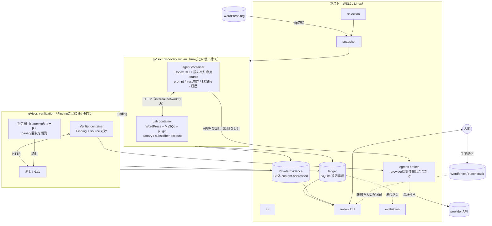
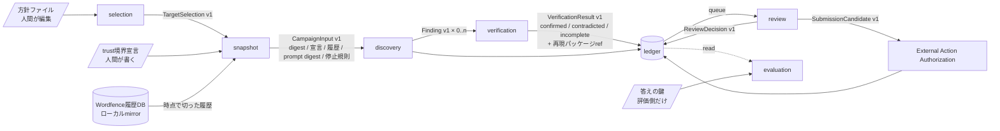
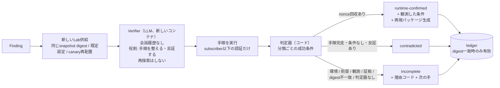
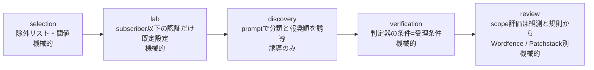
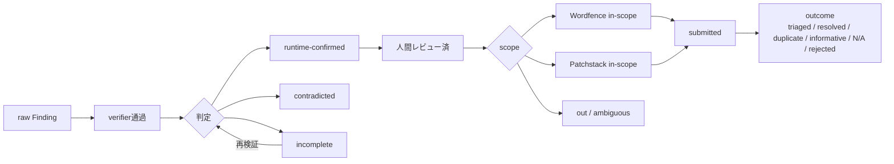
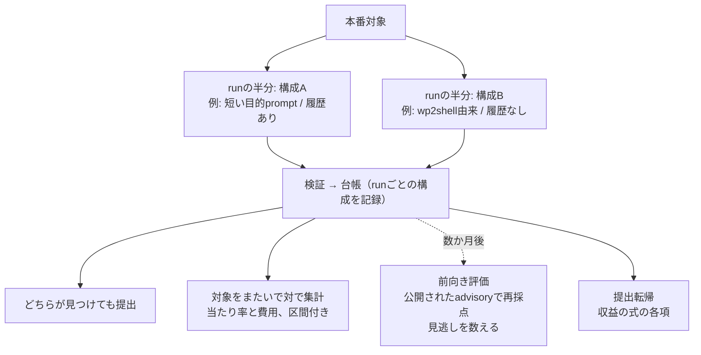

# アーキテクチャ図

理解用。境界の詳細は [SPEC.md](SPEC.md) 第4節・第5節、流れの説明は [DESIGN-WALKTHROUGH.md](DESIGN-WALKTHROUGH.md)。図はGitHubがそのまま描く（Mermaid）。

## 図1. 実行時の構成（何がどこで動き、何と通信できるか）



- agentとLabは同じrunのinternal networkだけで通信する。agentから外へ出られるのはbroker経由のprovider APIだけ。
- agent / Verifierに渡る認証情報は未認証・subscriber・customerのLabアカウントだけ。管理者とcontributor以上は渡らない。
- 台帳はdigest参照だけを持ち、payloadや画面画像はPrivate Evidenceに置く。

## 図2. 契約の流れ（モジュール間で渡るもの）



## 図3. Campaignと探索runの中身

```mermaid
flowchart TB
  subgraph CAMPAIGN[Campaign（対象1つ）]
    direction TB
    PART[profileが入口単位で<br/>file分担を作る] --> Q[run待ち行列<br/>最大N=40]
    Q --> R1[run 1] & R2[run 2] & R3[run 3] & R4[run 4]
    R1 & R2 & R3 & R4 --> STOP{新規Findingなしが<br/>k=4回連続?}
    STOP -->|いいえ| Q
    STOP -->|はい| END[停止・台帳へ]
  end
  subgraph ONERUN[run 1つの中（agentの裁量。Harnessは手順を指定しない）]
    direction TB
    IN[受け取る: prompt / trust境界 /<br/>担当file / Lab + subscriber認証 / 履歴] --> E1[入口を列挙<br/>wp_ajax_nopriv / REST / shortcode / $_GET]
    E1 --> E2[誰が叩けるか<br/>nonce? capability? login?]
    E2 -->|subscriber以下で届く| E3[危険な到達点まで追う<br/>SQL / file / option / role / 出力]
    E3 --> E4[途中のcheckを評価<br/>prepare / sanitize / esc / path検査]
    E4 --> E5{欠けている?}
    E5 -->|仮説あり| E6[Labに実際に送る<br/>canaryが動いたか自分で見る]
    E6 -->|成立| F[Findingを書く<br/>攻撃者位置 / 分類 / 経路 / 観測]
    E6 -->|不成立| E4
    E5 -->|なし| NX[次の入口]
    NX --> E2
    F --> OUT[出力: Finding[] + 読んだ範囲 / 読まなかった範囲]
    NX -.全部見た.-> OUT
  end
  R1 -.-> ONERUN
```

- runは互いを知らない。同じ場所を複数のrunが独立に指せば、それが確度の根拠になる。
- 1回で見つかる確率 p のとき、k 回で1度でも見つかる確率は 1 − (1 − p)^k。

## 図4. 検証: Verifierと判定器の分業



## 図5. 対象範囲を効かせる4か所



## 図6. Funnel（台帳から読む）



## 図7. 評価は本番の中で行う


