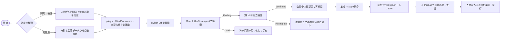
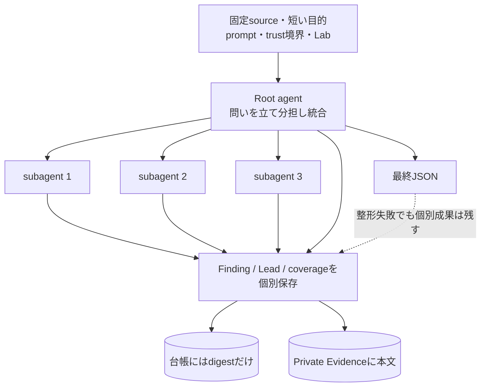
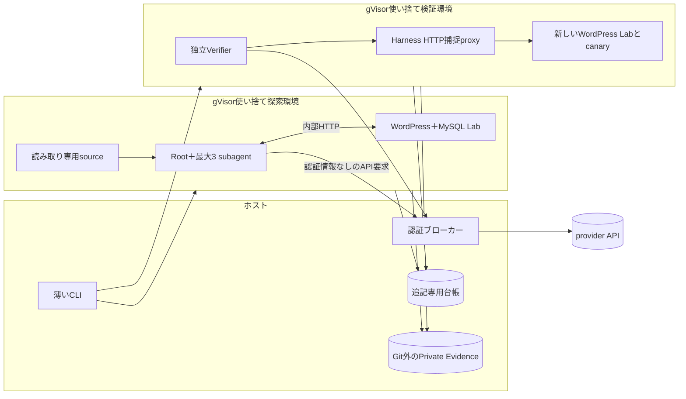
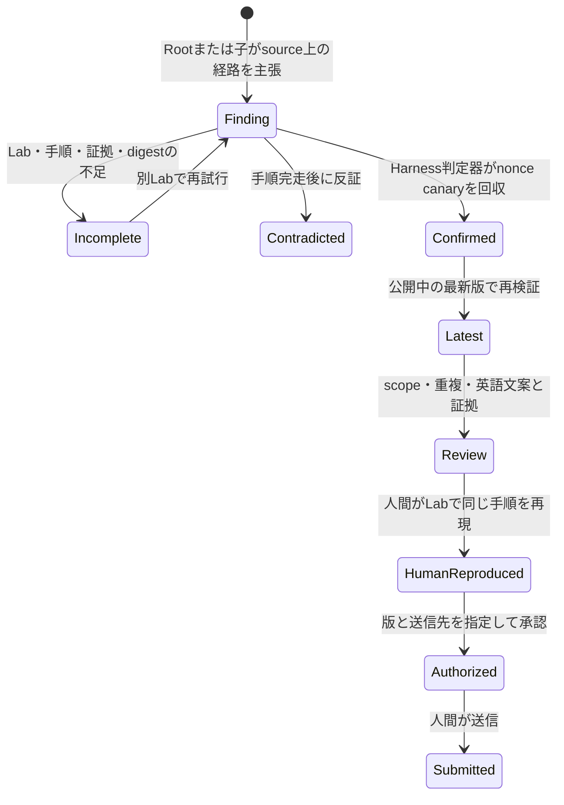

# アーキテクチャ図

目標構成を示す。実装済みとの差は [実装計画](IMPLEMENTATION-PLAN.md)、規則は [SPEC](SPEC.md) と [ADR 0016](adr/0016-root-plus-three-first-vertical-slice.md)。

## 1. どこから始まるか

開発対象では選定を待たない。報告候補は最新版で成立し、証拠と人間の手動再現を備えたものだけ。

## 2. 1つの協調Trial

Harnessは人数上限、隔離、時間、記録、停止を管理する。Rootが調べ方を決め、Harnessのpromptに固定役割や探索手順を埋め込まない。同じ版の別Trialを回す外側のループは残すが、回数と停止値は実測後に決める。

## 3. 実行境界

対象コードはホストで実行しない。エージェントに渡すLab資格情報は未認証・subscriber・customerの範囲だけ。provider以外の外向き通信は認めない。

## 4. 「発見」と「確認」と「提出」

`Finding` は主張、`runtime-confirmed` は技術的確認、`Submission Candidate` は提出先の条件を満たした文案付きの候補で、それぞれ別の記録として扱う。
