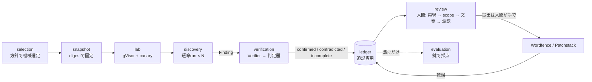

# 設計の読み解き（理解のための1ページ）

正本は [SPEC.md](SPEC.md) と [ADR](adr/)。この文書は仕様を「1つのプラグインが通る道」に沿ってかみ砕いたもので、規則の追加はしない。食い違えば正本が勝つ。完成後の操作は [OPERATIONS.md](OPERATIONS.md)。各判断の根拠と未証明の項目は [DESIGN-EVIDENCE.md](DESIGN-EVIDENCE.md)。図は [ARCHITECTURE.md](ARCHITECTURE.md)。

## 1. 全体の考え方

3つの原則でできている。

- **機械が流し、人間は最後だけ触る。** 選定、探索、検証までは無人で回る。人間が見るのは検証を通ったものだけ。未検証の候補を人間が見ても判断の質が出ず、人間が律速になるため。
- **「見つけた」と「本当だ」を分ける。** 探索エージェントが出すのは主張（Finding）で、確認ではない。確認は別コンテナの検証役（Verifier）と、Harness自身が持つ決定論的な判定器が行う。エージェントが「できた」と言っても、canaryが回収されなければ確認にならない。
- **全部を記録して、後から測る。** 台帳に全イベントを追記し、どこで何件減ったか（funnel）を読む。Harnessを変えたら、答えが分かっている問題で採点して差を数字で見る。

旧リポジトリ（wordpress-harness）は「人間の判断」と「prompt」が中心にあった。新リポジトリは「判定器」と「台帳」が中心にある。

## 2. 1つのプラグインが通る道

例: インストール数3万、WordPress.org配布の投稿フォーム系プラグイン。

### (1) selection: 今週の対象を機械的に決める

方針ファイルを読み、WordPress.orgの一覧から条件に合うものを順位付けする。条件は「500件以上」「WordPress.org掲載」「最近更新がある」「作者がAutomattic / Facebook / Google / SiteGround / Yoastでない」「配布停止でない」。順位は攻撃面の大きさ（未認証で届くAJAX / REST / shortcodeの多さなど）で付ける。人間の承認はない。方針ファイルを直せば順位が変わる。

### (2) snapshot: 調べるコードを固定する

プラグインのzipとWordPress本体を取得し、ファイル一覧とハッシュから1つのdigestを作る。以後の全記録はこのdigestを持つ。「このFindingはどの版のコードに対する主張か」が常に分かり、別の版の検証結果と混ざらない。

### (3) lab: 壊してよいWordPressを使い捨てで立てる

gVisor（隔離の強いコンテナ）の中に WordPress + MySQL + 対象プラグインを立てる。設定は既定のまま。「公開フォームが1つある」程度の一般的な初期データはprofileのsetup manifestで入れ、その内容もdigestに記録する。そして仕掛けを置く。

| 仕掛け | 何を置くか | 何の判定に使うか |
| --- | --- | --- |
| ロール別アカウント | subscriber、customer（WooCommerce時）と、基準記録用のcontributor〜admin | 探索・検証にはsubscriber以下だけ渡す。contributor以上は「正常動作の記録」にしか使わない |
| canary option | `wp_options` にランダム値の行 | SQLiで読み出されたか、options更新で書き換わったか |
| canary file | 推測不能な名前と中身のファイル | 任意ファイル読み取り / LFIで中身が返ったか |
| canary user | 他人のアカウント | 乗っ取りで認証状態を得たか |
| Execution Canary | 実行されると記録が残る仕掛け | RCE / PHPファイル書き込みが本当に実行に至ったか |
| canary受信先 | Lab内のHTTP受け口 | XSSがheadless browserで本当に実行されたか |

### (4) discovery: 短い探索を独立に何十回も回す

1回のrunが受け取るもの:

- 探索prompt（版付き、digest記録。初期候補はwp2shell由来と短い目的promptの2本で、評価で選ぶ）
- trust境界宣言（「未認証とsubscriberが攻撃者。contributor以上と管理者の設定は信頼する」）
- 担当するファイルの集合（プラグインを入口単位で分割したうちの1つ）
- Labの接続先と subscriber / customer の認証情報
- 読み取り専用のソース

渡すものに、時点で切った対象の公開履歴（カタログ情報）を加えることができる（ADR 0012）。渡さないもの: PoC・payload・再現手順、評価対象の答え、前のrunの結果、管理者やcontributor以上の認証情報、外向き通信。

runの中でエージェントはソースを読み、入口（AJAX action、RESTルート、shortcode）から辿り、「このcheckが欠けている」と思ったらLabに実際にリクエストして確かめる。そして主張を書く。主張には、攻撃者の立場、到達する影響の分類（SPEC第8b節の共通分類）、入口から効果までの経路（ファイル・関数・行）、既存のcheckをどう評価したか、Labで観測した事実、再現の手がかり、が必須。出せなければ0件で終わり、「調べた範囲と調べなかった範囲」だけ残す。

1つの対象に対して、ファイル分担を変えながら最大40回、同時4つ。新規Findingが4回続けて出なければ止まる。長い1セッションでなく短い多数にする理由は、文脈が肥大しないこと、並列化と費用見積もりが簡単なこと、同じ場所を複数runが独立に指せばそれ自体が信号になること。

### (5) verification: 別のコンテナで反証し、判定器で決める

各Findingは新しいコンテナのVerifierに渡される。Verifierは探索時の会話を持たず、Findingとソースと新しいLabだけで「本当か」を試す。役割は再現手順の環境不備を直すことと反証で、再探索はしない。

最後にHarness所有の判定器が結果を決める。判定器は決定論的で、分類ごとに成功条件が決まっていて、プログラムの受理条件に合わせてある。

- ファイルアップロード: 「Execution Canaryが実行された」だけが成功。`.php.png` や安全な拡張子内のコードは成功にならない。
- stored XSS: 「subscriberが置いた値が、未認証訪問者が見るページか全管理画面で実行され、canary受信先に届いた」が条件。文字列が反射しただけでは成功にならない。
- SQLi: canary行の読み出しか書き込み。Labは `wp_magic_quotes` 既定のまま。
- 権限昇格 / 乗っ取り: 低権限主体が管理者（またはcontributor以上）の認証状態か能力を得る。
- ファイル系 / LFI: canaryファイルに届き、pathと拡張子の両方を攻撃者が決められたことを記録する。

結果は3つ。

| 結果 | 意味 | その後 |
| --- | --- | --- |
| `runtime-confirmed` | 判定器の条件を満たした | 再現パッケージを生成し、レビュー列へ |
| `contradicted` | 手順どおりに実行したが条件を満たさず、Verifierが反証を書けた | 件数だけ記録 |
| `incomplete` | 環境、前提、手順、観測、証拠、digest不一致のどれかが欠けた | 理由コードと次の手を付けてレビュー列へ |

「検証できなかった」を「誤検知」と呼ばない。環境が原因で捨てると当たりを失う。

### (6) ledger: 全部を追記する

選定、snapshot、Lab供給、各run、各Finding、各検証結果、レビュー判断、scope評価、文案、承認、提出転帰が1つの台帳に入る。削除や上書きはなく、判定系のイベントはsnapshot digestが一致するときだけ有効。payloadや画面画像は台帳に入れず、Git外のPrivate Evidenceにdigest参照だけで結ぶ。

### (7) review: 人間が検証済みだけを見る

見るのは `runtime-confirmed` と、次の手付きの `incomplete`。confirmedには再現パッケージが付く。

- 手動手順（遠隔攻撃者の視点。WP-CLIのようなサーバー側操作は含めない）
- `requests` だけで動くPythonスクリプト
- Labの再構築情報（WordPress版、プラグイン版とdigest、初期データ、ロール）
- 判定器が取った証拠（HTTP記録、画面画像、canary回収ログ）

人間がやることは順に: 自分で再現する → 意味のある影響か・意図された動作でないかを判断する → ローカルのWordfence履歴DBで重複を照合する → プログラムごとのscope評価を見る（WordfenceとPatchstackで別に出る。Reflected XSSとCSRFはPatchstackだけ）→ AIが作った文案の版を承認する → 外部行動を承認する → 自分でプログラムの画面から送る → 転帰を台帳に戻す。提出直前には最新版のsnapshotで再検証する（両プログラムが「最新版で成立」を要求する）。

## 3. 対象範囲をどう守らせるか

promptだけに頼らず、4か所で違う強さで効かせる（SPEC第8b節）。

| 場所 | 手段 | 強さ |
| --- | --- | --- |
| selection | 対象外資産と閾値を方針ファイルで落とす | 機械的。対象が入らない |
| lab | 渡す認証情報を未認証・subscriber・customerに限る。設定は既定のまま | 機械的。contributor以上の経路は試せず、設定変更もできない |
| discovery | 目的promptに影響の分類と報奨順を書く。trust境界宣言でcontributor以上を信頼側に置く | 誘導。他も報告してよいが台帳で分類される |
| verification / review | 判定器の成功条件を受理条件に合わせる。scope評価は観測と方針ファイルの規則だけから出す | 機械的。提出候補にならない |

## 4. 守り（不変条件を仕組みで成立させる）

- 既知脆弱性は時点で切る（ADR 0012）。本番では対象プラグインの公開履歴（種別、影響版、修正版、公開日。PoCは含まない）を渡し、「修正の回避」と「同じパターンの別の場所」を狙えるようにする。評価runではheld-outの公開日より前の履歴だけ渡し、答えそのものは渡さない。こうすると「見つけた」と「知っていた」を評価で区別できる。
- 対象コードはgVisorの中でしか動かさない。隔離が使えないときは止まり、通常のDockerへ黙って落ちない。
- エージェントに渡さないもの: provider認証情報（egress brokerが代理で通す）、管理者とcontributor以上のアカウント、コンテナソケット、外向き通信。渡さないので使えない。
- 確認は判定器だけ。証明はcanaryの回収に限り、リバースシェルや永続化は使わない。
- 外部送信はHarnessが行わない。承認を記録するだけで、送るのは人間。

## 5. 測り（Harnessを変えたとき良くなったかを数字で答える）

主指標は本番から得る。held-outは任意（理由は DESIGN-EVIDENCE 第12節）。

- 本番A/B: runが独立なので、同じ対象でrunを構成A / Bに分担して回す。どちらが見つけても提出でき、予算を無駄にしない。prompt、履歴有無、分担単位、Verifier有無などはこれで比べる。
- 前向き評価: 本番の台帳を、後日公開されたadvisoryで採点する。「あったのに見逃した」が分かる唯一の方法で、費用はゼロ。
- 提出転帰: triaged / duplicate / rejected の率と報奨額。収益に直結する最終の数字。
- 判定器の負の対照: 修正版で判定器が鳴らないことを確認する。安い。
- 答えの鍵: 本人発見7件＋補助4件を登録しておく（人間の1時間程度）。大きな設計変更をしたときに、予算内で一部を回せる。採点は機械の「場所の重なり」を必要条件とし、人間が盲検で「場所、原因、攻撃者条件、影響」の4要素を見る。本当の成功は「target-hit かつ runtime-confirmed」。
- 区間を必ず併記し、重なる差は「判定不能」と書く。

## 6. 旧リポジトリから何を持ってきて、何を新しく作るか

| 持ってくる | 持ってこない | 新しく作る |
| --- | --- | --- |
| snapshot固定、gVisor Lab供給、Codex adapterと認証ブローカー、Wordfence観測、scope評価、Draft / Authorization | Research Campaignsの内部、継続Campaign、条件付き3試行、Human Candidate Review、Approved Target Batch、旧スキーマ | discoveryの多数run制御、Verifier、判定器、台帳、review CLI、evaluation |

## 7. 参照した設計

- Anthropic find-and-fix loop: 短い目的prompt、短命runの多数独立実行、独立verifier、「PoC失敗≠誤検知」。
- Google Mantis: 固定段階は採らない。記録の規則（snapshot gating、再現したものだけ数える、重複判定は安全側）だけ採る。
- OpenAI Codex Security、Cloudflare VDH、XBOW: 隔離コンテナでの検証、段階別の記録とfunnel、決定論的な判定器。

## 8. 技術的な補足

### gVisorとは何で、なぜ使うか

通常のDockerコンテナは、ホストのLinuxカーネルをそのまま共有する。コンテナ内のプロセスが出すシステムコールはホストカーネルが直接処理するので、カーネルの脆弱性を突かれるとコンテナから抜けてホストに届く。探索エージェントも対象プラグインも「信用できないコード」なので、この壁では足りない。

gVisor（実行コマンド名 `runsc`）は、コンテナとホストカーネルの間に「ユーザー空間で動く小さなカーネル」（Sentry）を挟む。コンテナ内のシステムコールはまずSentryが受け、Sentryが自分で処理するか、ごく限られた呼び出しだけをホストへ渡す。ホストカーネルに届く攻撃面が大幅に減るため、Google Cloud RunやAnthropicの探索基盤が同じ方式を使っている。Dockerからは `--runtime=runsc` を付けるだけで使え、イメージは変えなくてよい。代償は性能（I/Oとシステムコールが遅い）と、一部の機能が動かないこと（ここが第14節のspike: headless browserが中で動くか）。

Harnessでは2種類のコンテナをgVisorで動かす。

| コンテナ | 中身 | 外に出られる先 |
| --- | --- | --- |
| Lab | WordPress + MySQL + 対象プラグイン + canary | なし。同じrunのinternal networkだけ |
| agent（discovery run / Verifier） | Codex CLI + 読み取り専用source | Lab（HTTP）と、egress broker経由のprovider APIだけ |

「利用不能時に弱い隔離へ黙って切り替えない」のは、runscがないホストで通常のDockerにfallbackすると、対象コードがホストカーネルに触れるため。起動前に確認し、なければ止まる。

### egress broker（認証ブローカー）

エージェントがOpenAIのAPIを呼ぶにはAPIキーかログイン情報が要るが、それをコンテナに置くと、対象コードやpromptの汚染で盗まれうる。そこでキーはホスト側のブローカーだけが持ち、コンテナからは認証なしのローカルendpointへ送り、ブローカーが認証を付けて転送する。ブローカーは転送先をprovider APIに固定し、それ以外の外向き通信は存在しない。旧リポジトリの `provider-credential-egress-broker` がこれで、新リポジトリの `src/discovery/` に移してある。

### Snapshot digest

取得したzipを展開し、ファイルの相対path・内容ハッシュ・権限を正規化した一覧（canonical manifest）にして、その一覧のハッシュをdigestとする。symlinkや不正pathやサイズ超過はここで拒否する。Findingにも検証結果にもこのdigestが入り、台帳はdigestが一致するときだけ判定を有効にする。これにより「探索したのは3.1.0、検証したのは3.1.1だった」という事故が起きない。

### canaryとnonce

canaryは「本来触れないはずの場所に置いた、推測不能な値」。nonceはその値のこと（1回限りの乱数）。判定器は「nonceが応答に出た」「nonceが受信先に届いた」「nonceの行が変わった」という事実だけを見る。エージェントの説明文を読まない。これが決定論的判定器の意味で、同じ入力なら誰がやっても同じ結果になる。

| 分類 | canaryの置き方 | 判定器が見る事実 |
| --- | --- | --- |
| RCE / PHPファイル書き込み | Execution Canary: 実行されるとLab内の受信先へnonceを送るコード片。攻撃者が置けるのは「実行されたら記録が残る」ものだけで、シェルは取らない | 受信先のログにnonceがある |
| SQLi | `wp_options` やcanary表にnonce入りの行 | 応答にnonceが出る、またはcanary表に書き込みがある |
| ファイル読み取り / LFI | nonceを中身に持つファイルを `wp-content` 外に置く | 応答にnonceが出る。path と拡張子を攻撃者が指定した記録 |
| options更新 | nonce入りのcanary option と、重大なoption（`users_can_register` 等）の初期値 | 低権限のリクエスト後に値が変わった |
| XSS | subscriberがnonce入りのscriptを置く。Lab内のheadless browser（Chromium）が、未認証訪問者としてページを開き、別に管理者として管理画面を開く | 受信先にnonceが届いた。どのcontextで発火したかを記録 |
| 権限昇格 / 乗っ取り | canary user と、各ロールの正常操作の記録 | 低権限のセッションが管理者だけの操作に成功、または他主体の認証状態を得た |

### 探索1回（discovery run）の中で何が起きるか

Harnessが用意するのは、prompt、trust境界宣言、担当ファイル、Lab、認証情報だけ。中の手順はエージェント（Codex CLIの上のgpt-6.1-sol）が自分で決める。典型的にはこう進む。

1. 担当ファイルから入口を列挙する。WordPressでは、`add_action('wp_ajax_nopriv_…')`（未認証AJAX）、`wp_ajax_…`（認証AJAX）、`register_rest_route`（REST。`permission_callback` が誰を通すか）、`add_shortcode`（投稿内で動く）、`init` / `template_redirect` で `$_GET` / `$_POST` を読むもの、フォームの送信先。
2. 入口ごとに「誰が叩けるか」を読む。nonce検査、`current_user_can`、ログイン要否、`permission_callback`。trust境界宣言により、subscriberで届く入口だけが価値を持つ。
3. 入口から先を辿り、危険な到達点（SQL、ファイル操作、option更新、user metaやroleの変更、出力）までのデータの流れを追う。途中の制御（`$wpdb->prepare`、`sanitize_*`、`esc_*`、拡張子検査、path正規化）を1つずつ評価する。
4. 「このcheckが欠けている、または迂回できる」という仮説を立てたら、Labに対してsubscriberまたは未認証でリクエストを送り、canaryが動いたかを自分で見る。動かなければ仮説を直すか捨てる。
5. 成立したと思うものをFindingとして書く。攻撃者の立場、影響の分類、経路、既存controlの評価、Labで観測した事実、再現の手がかり。成立しなければ0件で終わり、「読んだ範囲と読まなかった範囲」を残す。

Harnessはこの手順を強制しない。promptに手順を書き込むのはwp2shell由来の変種で、短い目的promptの変種は目標と境界だけを渡す。どちらが良いかは評価で決める。

### なぜ1回ではなく40回か

1回の探索でその脆弱性が見つかる確率を p とすると、独立に k 回やって1度でも見つかる確率は 1 − (1 − p)^k。p が 0.2 でも k = 10 で 0.89、k = 20 で 0.99 になる。探索は確率的で、同じ入力でも読む順番や立てる仮説がrunごとに違うため、独立試行を重ねるほど見逃しが減る。これがpass@kの考え方で、AnthropicもOpenAIも同じ理由で多数の短いrunを使う。

加えて3つの利点がある。

- **分担で網羅する。** 1 runに全ファイルを渡すと、文脈が肥大して後半の判断が落ちる。入口単位で分割して各runに違う担当を渡せば、各runは自分の範囲を深く読める。
- **一致が信号になる。** 互いを知らない複数のrunが同じ場所を指したら、それ自体が確度の根拠になる。長い1セッションではこの信号が得られない。
- **測れる。** 各runが独立なので、5試行の当たり率に区間が付けられ、構成を変えたときの差を統計的に比べられる。

40は上限であって目標ではない。実際の停止は「新規Findingなしが4回続いたら」で、多くの対象は10〜20回で止まる見込み。40とk = 4の初期値はCodex Securityのdeep scanの既定に合わせたもので、第14節のspikeで1 runの費用と時間を測ってから調整する。同時4つはホストの資源とproviderのrate limitによる上限。

### Verifierと判定器の分業

Verifierはエージェント（LLM）で、判定器はコード。Verifierの仕事は「Findingの再現手がかりを、新しいLabで動く手順にすること」と「反証を試みること」。たとえばFindingが指すAJAX actionが別の設定に依存していたら、それを見つけて `incomplete(precondition)` に理由を書く。判定器の仕事は、その手順を実行した後にcanaryの事実があるかを見るだけ。Verifierが「成功した」と書いても、判定器がnonceを見つけなければ `runtime-confirmed` にならない。逆にVerifierが懐疑的でも、nonceがあれば confirmed になる。

### 分担（file partition）の単位

プラグインを「ファイル単位」で割ると、1つの機能が複数ファイルにまたがって文脈が切れる。「入口単位」（1つのAJAX action、1つのRESTルート、1つのshortcodeと、そこから到達する関数群）で割ると、各runが1つの機能を端から端まで読める。profileが入口を列挙して分担を作り、共通ライブラリ（ヘルパー、DB層）は全runに読み取り可能にする。どちらの単位が良いかも評価で比べる（SPEC第10節のablation「分担有無」）。

## 9. 起きやすい認識のずれ

| ずれやすい理解 | 実際 |
| --- | --- |
| Harnessが脆弱性を見つける | 見つけるのはモデル（gpt-6.1-sol）。Harnessは流れの管理、隔離、判定、記録だけを持つ。探索の手順を持たない |
| 40回回すから費用は1回の40倍 | 40は上限。新規なし4回連続で止まるので、空の対象は10回前後で終わる見込み。費用はspikeで測ってから上限を決め直す |
| Verifierが確認する | Verifierは手順を整えて反証を試すLLM。確認（`runtime-confirmed`）を出すのは判定器（コード）だけ |
| `incomplete` は失敗 | 失敗ではなく「まだ判定できていない」列。理由コードと次の手が付き、人間かHarnessが続きをやる |
| scopeで探索を絞る | 探索を直接は絞らない。Labの認証情報（subscriber以下だけ）と判定器の成功条件で機械的に効かせ、promptでは誘導するだけ。scope外の発見も台帳には残る |
| 評価は本番と別の作業 | 本番そのものが評価。同じ対象でrunを構成A / Bに分けて回し（本番A/B）、後日のadvisoryで台帳を再採点する（前向き評価）。held-outは任意 |
| 履歴を渡す = 答えを渡す | 履歴は「このpluginで過去に何が修正されたか」のカタログ情報。評価では時点で切る。答え（原因箇所、PoC）は渡さない |
| 人間が承認しないと進まない | 人間の判断点は「提出前のレビュー」と「外部行動の承認」だけ。選定と探索と検証は無人で進む |
| Labは1つ | Labは探索runごと、検証ごとに使い捨てで作る。同時4 runなら同時に4つ以上のLabが動く。ホストのCPUとメモリが制約 |
| Pro購読なら使い放題 | rate limitと使用量上限がある。1 runの消費を測り、上限に当たるならAPIキーへ切り替えを判断 |
| 再現パッケージ = Verifierのログ | 判定器が通った経路だけを再生成した資料。試行錯誤は入らない。途中経過はPrivate EvidenceのVerifier run記録を別に開く |
| Harnessが提出する | 提出は人間がプログラムの画面で行う。Harnessは承認を記録するだけ |
| Target Profileの汎用化を今やる | WordPress固有をprofileに閉じ込めるだけ。インターフェースの汎用化は2つ目の対象が来てから |
| 実装セッションが設計を決める | 設計はSPECとADRで決まっている。実装セッションが決めるのはモジュール内の詳細。SPECにない設計判断はIssueにコメントして推奨で進める |
| Findingが出れば提出できる | Finding → `runtime-confirmed` → Verified Vulnerability → scope評価で in-scope → Submission Candidate → 人間の承認、の順で絞られる。各段の件数がfunnel |

### 用語の対応

| 語 | 意味 | 誰が作るか |
| --- | --- | --- |
| Campaign | 1つの対象（snapshot）に対する探索と検証の一式 | `discovery.campaign` |
| Discovery run | 短命エージェントの1回の実行 | `discovery` |
| Finding | runが出した主張。確認ではない | エージェント |
| VerificationResult | `runtime-confirmed` / `contradicted` / `incomplete` | 判定器 |
| Verified Vulnerability | `runtime-confirmed` から作る技術的記録。scopeと独立 | `ledger` |
| Programme Scope Assessment | プログラムごとの in-scope / out / ambiguous | `review`（規則） |
| Submission Candidate | in-scopeのVerified Vulnerabilityに文案の版と送信先を結び付けたもの | `review` |
| External Action Authorization | 「この版をこの送信先へ出す」の承認記録 | 人間 |
| Private Evidence | payload、HTTP記録、画面画像、ログ、再現パッケージの置き場。Git外、content-addressed | 各モジュール |
| LedgerEvent | 台帳の1行。全部snapshot digestとcampaign idを持つ | 全モジュール |
