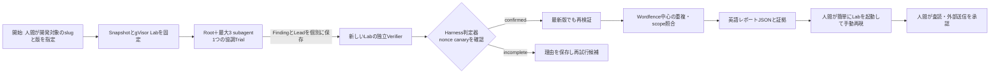
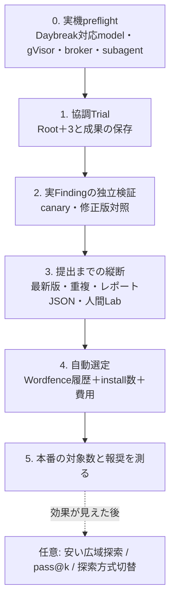

# 実装の道筋と現行機能の棚卸し

2026-10-10時点の `origin/main`（`fef1a4d`）を調べた作業計画。規則の正本は [SPEC](SPEC.md) と [ADR 0016](adr/0016-root-plus-three-first-vertical-slice.md)。ここで「実装済み」はコードがあるという意味で、実対象での成功を意味しない。

## まず完成させる1本

開発対象の脆弱版は探索と判定器の縦断試験用。実際の提出候補は公開中の最新版で再確認したものだけにする。人間の手動再現は提出前レビューの一部で、Harnessは外部送信しない。WordPress coreは同じ Snapshot の読み取り専用資料とし、別プラグインは必要な依存が確定した時にのみ版・digestを固定して加える。

## 現在から目標まで

| 領域 | 現在コードで確認できたこと | 目標までの差分 | 扱い |
| --- | --- | --- | --- |
| Snapshot / Lab | source digest、WordPress core pack、gVisor Lab、低権限アカウント、RO DB、canary、HTTP捕捉proxyがある | 実対象の協調Trialと独立Verifierを同じ固定版で通す | 再利用 |
| Discovery | `features.multi_agent=false`。単独 Trial の分担、最大2件の1 hop Lead継続、A/Bがある。実行profileは `gpt-6.1-sol` / `gpt-6-luna` のみ | Daybreak対応モデルの実機確認、Root＋3、子の成果の耐障害保存、使用量観測 | 最優先で置換 |
| Prompt / 出力 | 短い目的 prompt `short-objective-v2` と管理指示変種、最終JSON schemaがある | promptは短いままRoot協調で使う。子の有効なFinding/Leadが最終整形失敗で消えないようにする | 保持して補修 |
| Verification | 複数のnonce判定器と再現パッケージ生成、最新版の再検証口がある | 実Findingで独立Labを通し、修正版の負の対照と人間の手動再現まで証明 | 2番目に仕上げる |
| Selection | `candidateSlugs` は空。閾値は500件で、install数・更新日・tagを採点する。Wordfence履歴は探索入力と重複照合に使うが、選定の採点には使わない | 1万件以上を初期候補とし、低権限のSQLi・Stored XSS・RCE・乗っ取り等の履歴とinstall数を順位の説明可能な信号にする | 縦断後に修正 |
| 重複照合 | Wordfenceローカルmirrorの候補検索はある。更新は旧リポジトリのscriptに依存し、staleを未重複と扱わない | 検証後にfeed更新を試し、Wordfenceに加えてPatchstack / WPScanの公開情報を照合する。完全一致の自動断定はしない | 提出前の必須ゲート |
| Report / 人間Lab | 再現パッケージはある。`review draft --file` で人間が用意した文面を記録できる | 攻撃者視点のHTTP証拠から短い英語レポートと入力用JSONを自動生成し、Lab再構築を1コマンドに近づける | 最初の縦断内で完成 |
| 評価 / 実績 | `pnpm check` は63ファイル・533テストで通る。#73の開発セットでは両promptとも公開事例のsource候補0件 | まず実Findingから判定・レポートへ通す。発見率や費用優位はその後に測る | 先に実証 |

## 実装順

ユーザーの難しさの順は探索→検証→選定→レポートである。依存順では、最初の縦断にレポートと人間Labを最小限含め、選定の自動化を後にする。最初はslugと版を人間が指定してよい。これにより選定の不完成が発見能力の試験を妨げない。

## 外側のループと費用

同じ Snapshot に別Trialを回す余地を残す。最初のTrialの Finding または具体的 Lead に未解決のsource上の問いがある場合は次の探索候補にできる。何回連続で成果が無ければ停止するか、別対象へ移る期待値との比較は初期実測から決める。旧設定の「最大6 Trial・3回連続成果なし」をRoot＋3へそのまま適用しない。

広域スクリーニングは後で追加できるが、安い手法の陰性は深い探索の陰性を意味しない。追加時は固定した対象・モデル・予算で、`in-scope` かつ非重複の `runtime-confirmed` 件数／使用量を比較する。

## 実装Issue

| 優先 | Issue | 受入時に見えるもの | 先行条件 |
| --- | --- | --- | --- |
| 1 | [#92 Daybreak対応Root＋3 preflight](https://github.com/momoponwork1415-lgtm/wordpress-bounty-harness/issues/92) | 実機で4 agent、Lab、brokerが動く | なし |
| 2 | [#93 協調Trialの成果保存](https://github.com/momoponwork1415-lgtm/wordpress-bounty-harness/issues/93) | 子のFinding/Leadが最終JSON失敗でも残る | #92 |
| 3 | [#94 実Findingの独立検証](https://github.com/momoponwork1415-lgtm/wordpress-bounty-harness/issues/94) | 脆弱版でcanary確認、修正版で負の対照 | #93 |
| 4 | [#95 英語JSONと人間用Lab](https://github.com/momoponwork1415-lgtm/wordpress-bounty-harness/issues/95) | 証拠付き草案を人間がLabで再現 | #94 |
| 5 | [#96 最新版と重複照合](https://github.com/momoponwork1415-lgtm/wordpress-bounty-harness/issues/96) | 最新版、Wordfence / Patchstack / WPScanの候補と鮮度 | #94 |
| 6 | [#97 自動選定](https://github.com/momoponwork1415-lgtm/wordpress-bounty-harness/issues/97) | 低権限履歴とinstall数から最新版を選ぶ | 技術上はなし。着手順は#94後 |
| 7 | [#98 最新版の通し運用](https://github.com/momoponwork1415-lgtm/wordpress-bounty-harness/issues/98) | 選定から人間レビューまでの1本と費用 | #95、#96、#97 |

既存の [#10 Answer Key登録](https://github.com/momoponwork1415-lgtm/wordpress-bounty-harness/issues/10) は、**任意の評価データ整備**として残す。ここでの「鍵」はAPIキーやパスワードではなく、公開済み事例の入口・原因箇所・権限・影響を後で採点するための正解表。探索へは渡さず、人間による新たな脆弱性探索や再現を要求しない。公開sourceのpinは進んだが、正解表と補助事例は未完了であり、#92〜#98の発見経路を止めない。

## 減らす判断

既存のA/B、多軸割当、1 hop継続、独立Trialの停止規則は、Root＋3の縦断が通るまで主経路で使わない。台帳の過去データは読めるまま残し、削除は移行試験後に決める。外部サービスの本体、Codex CLI、Lab用の既存コンテナを再実装しない。
