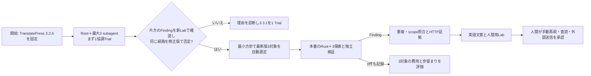
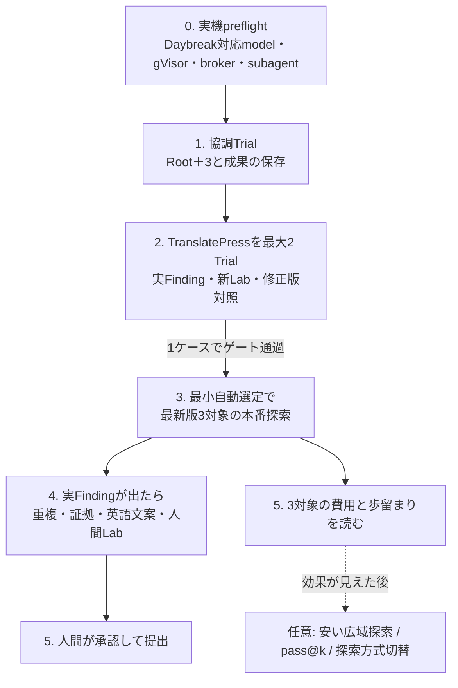

# 実装の道筋と現行機能の棚卸し

2026-10-10時点の `origin/main`（`fef1a4d`）を調べた作業計画。規則の正本は [SPEC](SPEC.md) と [ADR 0016](adr/0016-root-plus-three-first-vertical-slice.md)。ここで「実装済み」はコードがあるという意味で、実対象での成功を意味しない。

## ベンチマークから本番提出まで

開発対象の脆弱版は探索と判定器の縦断試験用。実際の提出候補は公開中の最新版で再確認したものだけにする。人間の手動再現は提出前レビューの一部で、Harnessは外部送信しない。WordPress coreは同じ Snapshot の読み取り専用資料とし、別プラグインは必要な依存が確定した時にのみ版・digestを固定して加える。

## 現在から目標まで

| 領域 | 現在コードで確認できたこと | 目標までの差分 | 扱い |
| --- | --- | --- | --- |
| Snapshot / Lab | source digest、WordPress core pack、gVisor Lab、低権限アカウント、RO DB、canary、HTTP捕捉proxyがあり、TranslatePress実機判定を通過した。pilotでは3対象を供給できた | 別のpluginでLab供給に失敗した原因を切り分ける | 再利用 |
| Discovery | Root＋最大3子を実機で起動し、子ごとのsource読取・wall・usage・成果を台帳へ残す。3対象のpilotは各1 Trialを完了した | 子reportの配列schemaを修正済み。残るRoot未許容eventを診断する | 実測済み |
| Prompt / 出力 | pilotは `short-objective-managed-v2`、現行既定はXSSの対象範囲を修正した `short-objective-managed-v3`。ADR 0017でWP2Shell式の報奨prompt `wp2shell-bounty-v1` を比較armとして追加した | 同条件のTrialで両promptのXSS再発見、ATO再発見、coverage、wall、出力の安定性を測る | 旧runと区別して記録 |
| Verification | TranslatePressのFinding 2件を独立Labでnonce確認し、修正版の同経路を `contradicted` とした。pilotのFinding 2件は `incomplete(no-judge)` | 根拠がある候補に限り安全なnonce判定器を追加する。確認後に最新版の再検証と人間の手動再現へ進む | 実機通過 |
| Selection | 新鮮なWordfence履歴から低権限・高影響候補を抽出し、WordPress.orgのactive install数をGit外DBへ観測日時付きで保存する。1万件以上・最新版・scopeを実行時に再検査し、履歴件数をscoreに記録する | pilot後に選定実績と既知重複から順位を調整する | 最小方針を実装 |
| 重複照合 | Wordfenceローカルmirrorの候補検索はある。更新は旧リポジトリのscriptに依存し、staleを未重複と扱わない | 検証後にfeed更新を試し、Wordfenceに加えてPatchstack / WPScanの公開情報を照合する。完全一致の自動断定はしない | 提出前の必須ゲート |
| Report / 人間Lab | 再現パッケージはある。`review draft --file` で人間が用意した文面を記録できる | 攻撃者視点のHTTP証拠から短い英語レポートと入力用JSONを自動生成し、Lab再構築を1コマンドに近づける | 本番探索は先行可。最初の外部提出前に完成 |
| 評価 / 実績 | `pnpm check` は63ファイル・550テストで通る。TranslatePressの実Finding・修正版対照を通過し、[3対象pilot](PILOT-2026-10-10.md)はFinding 2件、Lead 13件、`runtime-confirmed` 0件と記録した | 未許容eventとno-judgeを次の改善の根拠にする | pilot実行済み |

## 実装順

ユーザーの難しさの順は探索→検証→選定→レポートである。TranslatePressは人間が公開済みのslugと版を指定する。3.2.6で独立確認と修正版対照が通ればそこで止め、通らなければ診断後に3.3.1を試す。どちらかでゲートが通ったら、最小の自動選定で最新版の本番探索へ進む。提出のための文案・人間Labは実Findingが出た時に完成させる。[ベンチマークの上限と移行条件](TRANSLATEPRESS-BENCHMARK.md) を参照。

## 外側のループと費用

同じ Snapshot に別Trialを回す余地を残す。最初のTrialの Finding または具体的 Lead に未解決のsource上の問いがある場合は次の探索候補にできる。何回連続で成果が無ければ停止するか、別対象へ移る期待値との比較は初期実測から決める。旧設定の「最大6 Trial・3回連続成果なし」をRoot＋3へそのまま適用しない。

広域スクリーニングは後で追加できるが、安い手法の陰性は深い探索の陰性を意味しない。追加時は固定した対象・モデル・予算で、`in-scope` かつ非重複の `runtime-confirmed` 件数／使用量を比較する。

## 実装Issue

| 優先 | Issue | 受入時に見えるもの | 先行条件 |
| --- | --- | --- | --- |
| 1 | [#92 Daybreak対応Root＋3 preflight](https://github.com/momoponwork1415-lgtm/wordpress-bounty-harness/issues/92) | 実機で4 agent、Lab、brokerが動く | なし |
| 2 | [#93 協調Trialの成果保存](https://github.com/momoponwork1415-lgtm/wordpress-bounty-harness/issues/93) | 子のFinding/Leadが最終JSON失敗でも残る | #92 |
| 3 | [#94 実Findingの独立検証](https://github.com/momoponwork1415-lgtm/wordpress-bounty-harness/issues/94) | 脆弱版でcanary確認、修正版で負の対照 | #93 |
| 4 | [#100 最新版3対象の本番探索パイロット](https://github.com/momoponwork1415-lgtm/wordpress-bounty-harness/issues/100) | 最小自動選定で実探索し、費用と歩留まりを見る | #94 |
| 5 | [#95 英語JSONと人間用Lab](https://github.com/momoponwork1415-lgtm/wordpress-bounty-harness/issues/95) | 証拠付き草案を人間がLabで再現 | #94。実Findingが出たら優先 |
| 6 | [#96 最新版と重複照合](https://github.com/momoponwork1415-lgtm/wordpress-bounty-harness/issues/96) | 最新版、Wordfence / Patchstack / WPScanの候補と鮮度 | #94。提出前に必須 |
| 7 | [#97 選定順位付けの改善](https://github.com/momoponwork1415-lgtm/wordpress-bounty-harness/issues/97) | 低権限履歴・install数・pilot実績から最新版の順位理由を改善 | #100。pilotの最小方針を発展させる |
| 8 | [#98 最新版の通し運用](https://github.com/momoponwork1415-lgtm/wordpress-bounty-harness/issues/98) | 選定から人間レビューまでの1本と費用 | #95、#96、#97、#100。最初の本番探索の開始条件ではない |

既存の [#10 Answer Key登録](https://github.com/momoponwork1415-lgtm/wordpress-bounty-harness/issues/10) は**not plannedで終了**した。人間による正解表入力は要求しない。旧 `eval score --keys` は任意の研究用互換機能として残すだけで、#92〜#100と本番探索の開始を止めない。

## 減らす判断

既存のA/B、多軸割当、1 hop継続、独立Trialの停止規則は、Root＋3の縦断が通るまで主経路で使わない。台帳の過去データは読めるまま残し、削除は移行試験後に決める。外部サービスの本体、Codex CLI、Lab用の既存コンテナを再実装しない。
