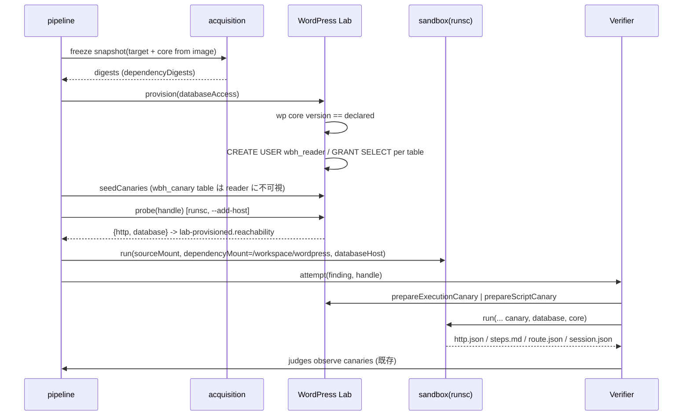

# 実装順 1〜3 の設計（2026-10-09）

位置づけ: [探索アーキテクチャのレビュー](2026-10-09-discovery-architecture-review.md) 第 6 節「実装順」の 1〜3 を、Codex が実装できる粒度まで詰めたもの。正本（SPEC.md / ADR）ではない。本文書と正本が食い違えば正本が勝つ。

範囲:

1. 検証の穴を塞ぐ — Verifier への canary 発行、`session.json` の受け口、失敗理由の台帳昇格、Lab 到達性の事前確認。
2. source pack に WordPress core を入れる — Dependency Snapshot と 2 つ目の read-only mount。
3. Lab の read-only DB アクセス — 探索 run と Verifier の両方へ。

範囲外: Trial 化、索引の拡張、Lead 継続、prompt A/B 軸、捕捉 proxy（実装順 4〜8）。これらは [別紙](2026-10-09-steps-4-8-design.md) にあり、到達点は [最終設計](2026-10-09-target-architecture.md)。

## 0. 作業ツリーの現状（先に読む）

この設計の大半は、本文書を書く前にレビュアーが作業ツリーへ試作として入れてある。**未コミット、`pnpm check` 未通過、Docker 実機では未実行**。Codex はこれを「たたき台」として扱い、本文書の契約へ合わせて仕上げる。要らなければ捨ててよい（ただし作業ツリーには本設計と無関係の未コミット変更も混ざっているので、`git checkout -- .` のような一括破棄はしない）。

試作で触った file:

| file | 状態 |
| --- | --- |
| `src/ledger/index.ts` | 第 3 節の 5 つの field を追加済み |
| `src/lab/index.ts` | `LabReachability` 型、`LabProvisioner.probe?` を追加済み |
| `src/cli/pipeline.ts` | probe 呼び出し、`reachability` と `dependencyDigests` の記録を追加済み |
| `src/discovery/campaign.ts` | `reason` / `providerLimit` の昇格を追加済み |
| `src/profiles/wordpress/lab/index.ts` | `databaseAccess`、`WordPressSource` の union、`handle.database`、RO user の作成、`probe` を追加済み。`WORDPRESS_CORE_IDENTITY` を export |
| `src/profiles/wordpress/acquisition/wordpress-core-source.ts` | 新規。image から core を取り出す |
| `src/profiles/wordpress/acquisition/materialized-sources.ts`, `acquisition/index.ts` | `kind` 判別と export を追加済み |
| `src/discovery/codex-gvisor-sandbox.ts` | `dependencyMount` と `databaseHost` の検証と args を追加済み |
| `src/discovery/codex-native-agent-runtime.ts` | `dependencySource` / `lab.database` を run に、`session.json` を検証報告 schema に追加済み |
| `src/profiles/wordpress/prompts/verifier-v2.md`（v1 から `git mv`）, `prompts/index.ts` | prompt v2 本文と loader の切替済み |
| `src/profiles/wordpress/verification/codex-verifier.ts` | canary 発行、`session.json`、`canaryIssued`、database / core の受け渡しを追加済み |
| `src/cli/wordpress.ts`, `src/cli/wordpress-host.ts` | config、`## Lab` 本文、plannedRuns、core source の配線を追加済み |
| tests 7 本 | source fixture に `kind: "plugin"` を足しただけ。新しい挙動のテストは未着手 |

最後の typecheck で残っていた error は 3 つ:

```
src/cli/wordpress-host.ts(242,35): Cannot find name 'ExpectedSourceTree'   # import 漏れ
src/discovery/codex-native-agent-runtime.ts(439,39): exactOptionalPropertyTypes  # dependencyMount / databaseHost を条件付き spread で渡す
tests/profiles/wordpress/codex-verifier.test.ts(127,38): Property 'lab' is missing  # fixture に lab を足す
```

それ以外に、prettier 未適用、Verifier prompt の digest pin が旧値のまま（第 7 節）、runtime テストの検証報告 fixture に `"session.json"` がない（第 7 節）。

## 1. 不変条件との対応

| 不変条件 | 本設計での守り方 |
| --- | --- |
| 1. 探索へ渡すのは固定 source と宣言と Lab だけ | core は Dependency Snapshot として digest 固定し、RO mount で渡す。DB は RO account で Lab の中だけ。答え・PoC・履歴は増やさない |
| 2. gVisor の中だけ、外向きは broker だけ | core の取り出しは `docker create` + `docker cp` で実行なし。probe は `--runtime=runsc --network <Lab>` の使い捨て container。DB host は `--add-host` で Lab 内 IP を名前解決させるだけで network は増やさない |
| 3. `runtime-confirmed` は判定器だけ、証明は nonce canary | canary を発行するのは Lab（Harness 所有）。Verifier は置くだけで、観測と判定は judges。`session.json` は Lab が `wp_validate_auth_cookie` で検証する |
| 4. 失敗は `incomplete` | probe の失敗、canary を発行できない場合、`session.json` の形式不正はすべて `incomplete` |
| 5. digest 一致 | core の digest は `snapshot-frozen.dependencyDigests` に入り、Lab は起動 image の `wp core version` と宣言 version の一致を確認する |
| 8. 台帳は digest 参照だけ | RO account の password、canary 本体、cookie は台帳へ出さない。台帳に増えるのは enum と digest のみ |

## 2. 契約（型と schema）

### 2.1 Lab（汎用 `src/lab/index.ts`）

```ts
export type LabReachability = {
  readonly http: "ok" | "failed";
  readonly database: "ok" | "failed" | "not-exposed";
};
export interface LabProvisioner<Setup, Handle extends LabHandle> {
  provision(setup: Setup): Promise<...>;         // 既存
  probe?(handle: Handle): Promise<LabReachability>; // 任意。実装がなければ pipeline は記録しない
  seedCanaries(handle: Handle): Promise<...>;    // 既存
  teardown(handle: Handle): Promise<void>;       // 既存
}
```

`probe` を optional にするのは、profile が 1 つしかない段階で汎用 interface を増やし過ぎない（ADR 0011）ため。

### 2.2 WordPress Lab（`src/profiles/wordpress/lab/index.ts`）

Setup:

```ts
databaseAccess: z.enum(["read-only", "none"]).default("none")
export type WordPressLabSetup = z.input<typeof setupSchema>; // 呼び出し側は省略可
```

Source の判別 union（plugin 以外を target にしない）:

```ts
type WordPressSource =
  | { kind: "plugin"; pluginSlug; sourceDirectory; sourceTree }
  | { kind: "wordpress-core"; version; sourceDirectory; sourceTree };
```

Handle（read-only のときだけ `database` が付く）:

```ts
database?: {
  host: "database";           // sandbox / probe が --add-host で解決する名前
  ipv4: string;               // Lab network 上の MariaDB container の IP
  port: 3306;
  name: "wordpress";
  readOnlyAccount: { username: "wbh_reader"; password: string }; // 32 byte 乱数
}
```

定数: `WORDPRESS_CORE_IDENTITY = "wordpress-core"`（export。acquisition 側はこれを import する。lab は acquisition を import しない）。

provision の追加順序（既存の手順の間に挟む位置を明示する）:

1. 依存 snapshot の digest 検証（既存）。`kind === "wordpress-core"` の item は `identity === WORDPRESS_CORE_IDENTITY && version === item.version` を確認して `coreVersion` に控える。**install はしない**（Lab は pinned image の core を使う）。
2. health check の後に `wp core version` を実行し、`coreVersion` と一致しなければ throw（message: `The Lab image runs another WordPress version`）。これで「渡した source」と「走っている core」が同一 version であることを provision 時に固定する。
3. plugin install / activate / initialPosts（既存）の**後**、`seedCanaries` の**前**に、`databaseAccess === "read-only"` なら RO user を作る:
   - `docker exec <db> mariadb --user=root --password=<root> --skip-column-names --batch --execute "SHOW TABLES FROM wordpress"` で table 一覧を取り、`/^[A-Za-z0-9_]{1,64}$/` に合わない名前は捨てる。
   - 1 回の `--execute` で `CREATE USER 'wbh_reader'@'%' IDENTIFIED BY '<pw>'; GRANT SELECT ON wordpress.<table> TO ...;（table ごと） FLUSH PRIVILEGES`。
   - **table 単位の GRANT にする理由**: 後から `seedCanaries` が作る `wbh_canary` table（SQL 読み出し判定の nonce）を reader に見せないため。`GRANT SELECT ON wordpress.*` は不可。`wp_options` の canary option は「値の変更」を判定するだけで読まれても証明にならないので可視でよい。file canary、実行 canary の salt、beacon nonce は DB にない。
   - plugin が activate 時に作る table は 3 の時点で存在するので読める。実行時に遅延作成される table は読めない（仕様として文書化）。
4. handle に `database` を付けて返す。

`probe(handle)`:

- `docker run --rm --runtime=runsc --network <Lab network> --add-host=wordpress:<internalIp> [--add-host=database:<dbIp> --env WBH_DB_HOST/USER/PASSWORD/NAME] --read-only --cap-drop=ALL --security-opt=no-new-privileges --tmpfs=/tmp --entrypoint=php <wordpress image> -r '<probe script>'`。
- probe script は `file_get_contents("http://wordpress/")` と、DB env があるときだけ mysqli で `SELECT 1`。stdout に 1 行 JSON `{"http":"ok"|"failed","database":"ok"|"failed"}`。
- 戻り値: JSON を parse して返す。docker 自体が失敗したら `{http:"failed", database: handle.database ? "failed" : "not-exposed"}`。handle に database がなければ `database: "not-exposed"`。
- sandbox と同じ `--add-host` 経路で測るのが目的。host から curl するのでは「agent container から届くか」を測れない。

`prepareExecutionCanary` / `prepareScriptCanary` は既存のまま。Verifier が呼ぶ（2.5）。

### 2.3 Acquisition（`src/profiles/wordpress/acquisition/`）

新 module `wordpress-core-source.ts`:

```ts
export function openWordPressCoreSource(options: {
  dockerExecutablePath: string;
  image: string;                // host config の pinned wordpress image（@sha256）
  stagingDirectory: string;     // <workDirectory>/wordpress-core
  expectedVersion: string;      // campaign config の wordpressVersion
  runDocker?: DockerCommand;    // テスト用の差し替え口
  limits?: { maxEntries?: number; maxBytes?: number }; // 既定 20_000 entries / 512 MiB
}): () => Promise<readonly AcquiredSource[]>;
```

手順: `docker create --pull=never <image>` → `docker cp <id>:/usr/src/wordpress <staging>.staging` → `<stagingDirectory>/<imageDigest>` へ rename → `docker rm --force`。既に `<imageDigest>/wp-includes/version.php` があれば再利用。`$wp_version` を読んで `expectedVersion` と不一致なら throw（`The Lab image runs WordPress X, not the declared Y`）。manifest は path 昇順の canonical-file-manifest、symlink / hardlink / 非 regular は拒否。返すのは `[{ identity: WORDPRESS_CORE_IDENTITY, version, manifest, readFile }]`。

`materialized-sources.ts` は identity から `kind` を判別し（`wordpress-core` か plugin slug）、`resolve()` の `dependencies` に `kind: "wordpress-core"` の item を返す。

配線（`wordpress-host.ts`）: `openWordPressOrgSnapshotSource({ targetSource, storageDirectory, dependencies: coreSource })`。既存の未使用 `dependencies` hook に差すだけで snapshot の凍結手順は変えない。

### 2.4 Sandbox と runtime（`src/discovery/`）

`CodexSandboxCommand` に optional を 2 つ:

```ts
dependencyMount?: { directory: string; path: "/workspace/wordpress"; mode: "ro"; expectedTree: ExpectedSourceTree };
databaseHost?: { name: string; ipv4: string };
```

検証: `dependencyMount.path` は `/workspace/wordpress` 固定、directory は絶対 path、tree は source と同じ `mountOf()` で canonical tree を確認。`databaseHost.name` は `labHost.name` と異なること、ipv4 形式。args に `--mount=type=bind,src=...,dst=/workspace/wordpress,readonly` と `--add-host=<name>:<ipv4>` を足す。**どちらも無ければ既存の args と完全に同じ**（既存テストの exact-match を壊さない）。

`DiscoveryTransportRun`:

```ts
lab: { endpoint; networkName; internalIp; database?: { host: string; ipv4: string } }
dependencySource?: { directory: string; tree: ExpectedSourceTree }
```

policy check で `dependencySource.directory` の絶対 path を要求。`exactOptionalPropertyTypes` に合わせ、sandbox へは条件付き spread で渡す（現状の error の原因）。

検証報告の structured output（strict schema）:

```
"http.json" | "steps.md" | "route.json" | "session.json" | "refutation.md" | "precondition"
```

`session.json` は `string | null`、`required` に入れる。

### 2.5 Verifier（`src/profiles/wordpress/verification/codex-verifier.ts`）

options の追加:

```ts
lab: Pick<WordPressLab, "prepareExecutionCanary" | "prepareScriptCanary">; // 必須
dependencySource?: { directory: string; tree: ExpectedSourceTree };
```

`attempt` の流れ:

1. 既存の admission の後、impact で canary を決める。`rce` / `php-file-write` → `prepareExecutionCanary`、`stored-xss` → `prepareScriptCanary`。それ以外は canary なし。
2. 必要な impact なのに Lab が `null` を返したら、run を起こさず `{ status: "incomplete", reason: "precondition", nextStep: "Issue a canary from a fresh Lab and repeat" }`。
3. `## Lab` の JSON に `endpoint`、`accounts`（既存）、`database`（host / port / name / readOnlyAccount、handle にあるとき）、`wordpressCoreSource: "/workspace/wordpress"`（dependencySource があるとき）、`canary`（`{kind:"execution", php}` か `{kind:"script", beaconUrl}`）を足す。prompt 本文の digest は固定 prompt 部分のみ（既存どおり）。
4. run に `dependencySource` と `lab.database`（host / ipv4）を渡す。
5. 報告の `session.json` が string なら `{ cookie: string }` を `z.strictObject` で検証し、cookie は `/^[A-Za-z0-9%|._@+-]{1,4096}$/`（Lab の `observeSessionUser` が受け付ける形）。不正なら `{ status: "incomplete", reason: "recipe" }`。正常なら canonical JSON にして recipe の `putFiles` に `session.json` として入れる。judges 側の session 観測は既存の経路（`observeSessionUser`）をそのまま使う。
6. `verifier-run-finished` に `canaryIssued: "execution" | "script"` を付ける（canary を発行したときだけ）。

Verifier prompt v2（`prompts/verifier-v2.md`）: v1 に、RO DB と core の所在、canary の置き方（実行 canary の PHP は改変しない、script canary は beacon URL を取得する script を置く、canary 自体を証明として報告しない）、`session.json` は `{ "cookie": "<別 principal の logged_in cookie>" }`、出力 6 field を足した。prompt テストの禁止語（`PoC`、`payload`、`CVE`、`<script`、`curl -` / `php -` の形）を含めないこと。digest は `sha256:a95b104f54d482095c766f91f91e8dd645f7f6c50c54aa11ccdc39d7c6a24161`（試作時点。本文を変えたら pin も更新）。

### 2.6 台帳（`src/ledger/index.ts`）

すべて optional。既存 event の後方互換を保つ。

| event | field | 値 |
| --- | --- | --- |
| `snapshot-frozen` | `dependencyDigests` | `digest[]`（core の sourceDigest） |
| `lab-provisioned` | `reachability` | `{ http: "ok"\|"failed", database: "ok"\|"failed"\|"not-exposed" }` |
| `discovery-run-started.configuration` | `labAccess` | `{ database: "read-only"\|"none" }` |
| `discovery-run-finished` | `reason` | `"provider"\|"schema"\|"sandbox"\|"policy"\|"evidence"`（receipt の `reason` から。`unavailable` は昇格しない） |
| `discovery-run-finished` | `providerLimit` | `"rate-limit"\|"quota"`（provider 失敗で判別できたとき） |
| `verifier-run-finished` | `canaryIssued` | `"execution"\|"script"` |

### 2.7 CLI（`src/cli/wordpress.ts`, `wordpress-host.ts`, `pipeline.ts`）

- campaign config `lab.databaseAccess: z.enum(["read-only","none"]).default("read-only")`。`setupFor` は `...config.lab` で渡すので追加配線は不要。Lab 側の既定は `none`、campaign 側の既定は `read-only`（Lab 単体は保守的に、campaign は SPEC 第 6 節の「Lab DB 読み取り」を既定で有効に）。
- `sourceFor(snapshot)` は `{ directory, tree, dependency?: { directory, tree } }` を返す。
- 探索 prompt の `## Lab` 本文に、`Database (read-only, Lab only): host database port 3306 database wordpress user wbh_reader / <pw>` の 1 行（`none` のときは「not exposed」の 1 行）と、`WordPress core source (read-only): /workspace/wordpress, the same version the Lab runs.` の 1 行を足す。手順や checklist は足さない。
- plannedRuns に `dependencySource` と `lab.database`、`configuration.labAccess` を入れる。
- `pipeline.ts`: `seedCanaries` の後に `probe` があれば呼び、`lab-provisioned` に `reachability` を記録。**`http === "failed"` なら Lab を ready にしない**（run を無駄にしない）。`database === "failed"` は記録だけ（run は走らせる。DB 不通の影響は `labAccess` と突き合わせて後から見る）。
- `wordpress-host.ts`: `openWordPressCoreSource({ dockerExecutablePath, image: host.images.wordpress, stagingDirectory: join(workDirectory, "wordpress-core"), expectedVersion: config.wordpressVersion, runDocker })` を `dependencies` に。`CodexVerifier` に `lab` と `dependencySource` を渡す。

## 3. 動作の流れ



## 4. 採らなかった選択肢

- `GRANT SELECT ON wordpress.*`: `wbh_canary` が読めて SQL 読み出し判定の nonce が漏れる。
- canary を seed 前の table から隠すために view を作る: 行単位の隠蔽は MariaDB の GRANT ではできず、view は plugin の query と衝突しうる。table 単位の GRANT と seed 順序で足りる。
- core を WordPress.org から取得: Lab が走らせる core は pinned image のものなので、image から取り出す方が「渡した source = 走っている code」を保証しやすい。版の照合は `wp-includes/version.php` と `wp core version` の 2 点で行う。
- core を target と同じ `/workspace/main` の下に置く: 分担（file 単位の割当）と digest の対象が混ざる。別 mount にして target の tree 検証を変えない。
- probe を host の curl で行う: agent container から届くかを測れない。
- DB の `database: "failed"` で Lab を落とす: DB は補助で、HTTP が通れば run は意味を持つ。記録に留める。
- Verifier に書き込み可能な DB account: 不変条件 3 に反する（judges 以外が状態を作れてしまう）。

## 5. 推測と未検証

- RO account の `GRANT` 文が MariaDB の pinned image で通ること、`SHOW TABLES` の出力形式（`--skip-column-names --batch`）は実機で未確認。
- probe の `php -r` が wordpress image の PHP で mysqli を使えること（mysqli 拡張は公式 image に入っているはずだが未確認）。
- Codex の agent image に MySQL client が入っていない場合、agent は DB に届いても query できない。その場合は OPERATIONS.md に「image へ `mariadb-client` を足す」と書く。これは探索 run の結果（DB を使ったか）を見てから判断する。
- `docker cp` で取り出した core の entries が 20_000 / 512 MiB の上限に収まること（WordPress 6.x は約 3,000 file / 70 MiB 程度と見込む。推測）。

## 6. テスト（受け入れ条件）

既存テストの更新:

- `tests/profiles/wordpress/discovery-prompts.test.ts`, `tests/profiles/wordpress/codex-verifier.test.ts`: Verifier prompt の digest pin を v2 の値に更新。
- `tests/profiles/wordpress/codex-verifier.test.ts`: fixture の `CodexVerifier` に `lab`（`prepareExecutionCanary` / `prepareScriptCanary` の fake）を渡す。
- `tests/discovery/codex-native-agent-runtime.test.ts`: 検証報告 fixture に `"session.json": null` を足す（strict schema）。
- `tests/discovery/codex-gvisor-sandbox.test.ts`: dependency なしの既存 exact-match は不変のまま通ること。

新規テスト:

| 対象 | 確認すること |
| --- | --- |
| Lab provision (fake docker) | `read-only` で `CREATE USER` と table ごとの `GRANT SELECT` が 1 回の `--execute` で流れ、handle に `database` が付く。`none` では流れず handle に `database` がない。`wp core version` 不一致で throw |
| Lab probe (fake docker) | `--runtime=runsc`、`--network`、`--add-host` の両方、`--env WBH_DB_*` が args に出る。JSON を返す。docker 失敗で `http: "failed"` |
| wordpress-core-source (fake docker) | `docker create --pull=never` → `cp` → `rm --force` の順、version 不一致で throw、再利用、symlink 拒否、manifest が path 昇順 |
| materialized-sources | `wordpress-core` identity が `kind: "wordpress-core"` で resolve される |
| sandbox | `dependencyMount` で `--mount` が 3 本目として出る、path が `/workspace/wordpress` 以外なら throw、`databaseHost.name === labHost.name` なら throw |
| runtime | `dependencySource` と `lab.database` が sandbox command に渡る、相対 path は policy で拒否、報告に `session.json` が入る |
| Verifier | `rce` で execution canary が `## Lab` JSON に入り `canaryIssued: "execution"` が記録される。`stored-xss` で script。canary が `null` なら run を起こさず `incomplete/precondition`。`session.json` の不正 cookie で `incomplete/recipe`、正常なら recipe に `session.json` が入る |
| ledger | 新 field が optional で既存 event がそのまま通る、enum 外は拒否 |
| campaign | receipt `reason: "provider"` が `discovery-run-finished.reason` に出る、`unavailable` は出ない |
| CLI (`cli.test.ts`) | `## Lab` に database 行と core 行が出る、`configuration.labAccess` が記録される、`databaseAccess: "none"` で「not exposed」行になる |
| pipeline | `probe` が `http: "failed"` を返したら Lab は ready にならず `lab-provisioned.reachability` が記録される |

`pnpm check`（typecheck + prettier + vitest）が通ることを完了条件にする。

## 7. 文書の更新

- `docs/OPERATIONS.md`: `lab.databaseAccess` の説明、`<workDirectory>/wordpress-core` の staging、`lab-provisioned.reachability` の読み方、agent image に MySQL client が必要になりうること。
- `docs/SPEC.md` 第 6 節 / 第 7 節: core は `/workspace/wordpress` に read-only で渡す、Verifier は Lab が発行した canary を受け取り `session.json` を返せる、の 2 点を短く足す。規則は増やさない。
- `examples/translatepress-3.2.5/*.json`: 既定が `read-only` なので変更不要。明示したければ `lab.databaseAccess` を 1 行足す。

## 8. 公開制限

本文書と実装に、RO account の実 password、canary の値、cookie、HTTP 記録、未公開の候補は含めない。台帳に出るのは enum と digest のみ。
