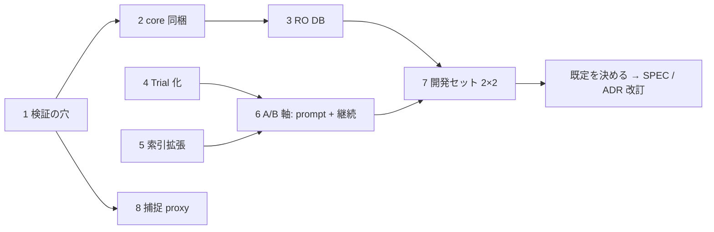

# 最終の全体設計（到達点、2026-10-09）

位置づけ: レビュアーが提案する「実装順 1〜8 を終えた時点の Harness」の全体像。正本（SPEC.md / ADR）ではない。正本の改訂案は第 11 節にまとめ、採用されれば SPEC と ADR 0013〜0015 へ移す。段ごとの実装粒度は [1〜3](2026-10-09-steps-1-3-design.md) と [4〜8](2026-10-09-steps-4-8-design.md) の別紙。判断の根拠と退けた案は [レビュー](2026-10-09-discovery-architecture-review.md)。

## 1. 到達点を一言で

**「索引分担つき深い独立 Trial」**。対象 1 つを、保存先で結ばれた成分ごとの scope に分け、各 scope を 90 分の独立 Trial で深く調べる。Trial は自分の Lead に限って 1 hop 継続できる。探索の手順は agent が決め、Harness は隔離、分担、停止、判定、記録だけを持つ。検証は Harness が発行した canary と Harness が捕捉した HTTP で判定器が決める。

変えないもの: 8 つの不変条件、profile 分離、追記専用台帳、2 つの人間判断点、Harness が外部送信しないこと。

## 2. 不変条件と、到達点での守り方

| # | 不変条件（AGENTS.md） | 到達点での実装 |
| --- | --- | --- |
| 1 | 探索へ渡すのは固定 source、trust 境界、Programme Boundary、Lab、時点で切った公開履歴 | source pack = plugin（`/workspace/main`）+ core（`/workspace/wordpress`）、両方 digest 固定。索引は source から機械的に作る派生物で、答えを含まない。Lead の近傍も索引由来。履歴は ADR 0012 のまま |
| 2 | runsc の使い捨て環境だけ。外向きは broker だけ | 変更なし。DB は Lab 内の RO account、proxy も Lab 内 |
| 3 | `runtime-confirmed` は Harness 所有の判定器だけ、証明は nonce canary | canary の発行は Lab、Verifier は置くだけ。HTTP は Harness が捕捉。session は Lab が cookie を照合 |
| 4 | 検証の失敗は `incomplete` | probe 失敗、canary 未発行、`session.json` 不正、capture 欠落はすべて `incomplete` と理由コード |
| 5 | 同じ Target Snapshot digest のときだけ判定 | core の digest も `snapshot-frozen.dependencyDigests` に入り、Lab は走っている core の版を照合 |
| 6 | 人間判断点は提出前レビューと外部行動承認の 2 つ | 変更なし。Trial、継続、A/B の割当はすべて機械 |
| 7 | 外部送信は承認があるときだけ、Harness は送らない | 変更なし |
| 8 | 台帳は digest 参照だけ | 新しい項目は enum と digest のみ。Lead の key 名、RO account の password、canary、cookie、capture は Private Evidence |

## 3. 全体の流れ

```mermaid
flowchart TB
  SEL[selection<br/>方針から対象と runBudget] --> SNAP[snapshot<br/>plugin + core を digest 固定<br/>dependencyDigests]
  SNAP --> LAB[lab（profile）<br/>WP + MariaDB + canary 受信先 + proxy<br/>RO DB account、probe]
  SNAP --> IDX[index（profile）<br/>入口 / 保存先 key / producer・consumer / core 交差<br/>連結成分 → scope、digest]
  IDX --> PLAN[Trial 計画<br/>T_max、arm 割当（history / prompt / continuation）]
  LAB --> PLAN
  PLAN --> TQ{{Trial 待ち行列<br/>同時 2、日次 cap は Trial 数}}
  TQ --> T[Trial: 探索 run 90 分<br/>新 container、scope、source pack、Lab HTTP + RO DB]
  T --> OUT[Finding[] + Lead[] + examined / unexamined]
  OUT -->|Lead、arm b| C[継続 run 30 分 × ≤2<br/>新 container、その Lead + 索引近傍だけ]
  C --> OUT2[Finding[] + Lead[]]
  OUT --> STOP{新規 Finding も Lead も無い Trial が k_t 連続?}
  OUT2 --> STOP
  STOP -->|no| TQ
  STOP -->|yes| END[discovery-concluded]
  OUT --> V
  OUT2 --> V
  subgraph V[verification]
    direction TB
    VER[Verifier（新 container）<br/>入力: Finding、source pack、Lab、Lab 発行 canary<br/>出力: http.json / steps.md / route.json / session.json] --> J[judges（決定論）<br/>canary 回収、proxy 捕捉、session 照合、role 差分]
    J --> R[runtime-confirmed / contradicted / incomplete]
  end
  R --> REV[review（人間）<br/>再現パッケージ、scope、重複、文案、承認]
  LEDGER[(ledger: 追記専用、digest 参照)] -.- SNAP & LAB & PLAN & T & C & V & REV
  EVAL[evaluation<br/>A/B（Trial 単位）、前向き評価、funnel] -.-> LEDGER
```

## 4. モジュール境界（到達点）

汎用モジュールは profile の型を import しない（ADR 0011）。表の「変更」は現状との差。

| モジュール | 到達点の責務 | 変更 |
| --- | --- | --- |
| `selection` | 方針から対象と `runBudget`（Trial 数）を出す | `runBudget` の意味を Trial 数に。値は再調整（既定 6） |
| `snapshot` | Target と Dependency（core）を digest 固定 | core の materialize（profile の `wordpress-core-source`）を `dependencies` に配線 |
| `lab`（汎用 interface） | provision / probe / seedCanaries / teardown | `probe?` と `LabReachability` を追加 |
| `profiles/wordpress/lab` | WP + MariaDB + canary 受信先 + proxy、RO account、canary 発行、session 照合、capture 回収 | RO user、probe、`database` handle、proxy container、`readCapture` |
| `profiles/wordpress/discovery` | 入口索引、保存先索引、成分分担、scope 文、Finding / Lead の admit | `storage-index.ts`、`lead.ts` を追加 |
| `discovery`（汎用） | Trial の列を回す。探索 run と継続 run、arm 割当、停止、cap、深さの観測、receipt | `PlannedTrial`、`runKind`、`observed`、多軸 arm |
| `discovery/codex-*` | runsc 内で Codex CLI を動かす transport | 第 2 mount、DB host、`session.json`、`leads` |
| `verification`（汎用） | Verifier と judges を回し結果を台帳へ | `evidenceCapture` の記録 |
| `profiles/wordpress/verification` | Codex Verifier（canary を受け取り、session を返す）、判定器集合（proxy 捕捉を優先） | canary 発行経路、`session.json`、capture 読み |
| `ledger` | 追記、読み、funnel、usage | 第 8 節の項目、`lead-recorded` |
| `review` | 変更なし | なし |
| `evaluation` | A/B（軸と cell）、前向き評価、鍵の採点（Finding と Lead） | 分母を探索 run に、Lead の列 |
| `cli` | 薄い配線 | 設定 schema の既定値、`continuation`、`ablation.axes` |

## 5. 探索の設計

### 5.1 単位と境界

- **Trial** が独立試行の単位。pass@k の k は Trial 数。1 Trial = 1 scope + 新しい container + 探索 run 90 分 + 継続 run ≤2 × 30 分。
- **独立**: Trial 同士は Finding、Lead、transcript、examined を共有しない。
- **試行内継続**: 探索 run が出した Lead のうち上位 2 件に、1 hop の継続 run を出せる。継続 run は新しい container で、受け取るのは Lead 記録と索引上の近傍だけ。継続 run の Finding は親 Trial の成果で、独立試行数を増やさない。
- **scope**: 索引の連結成分（保存先 key で結ばれた入口群）。producer と consumer が同じ Trial に入る。成分が大きければ key で割り、境界 key を両側に書く。索引は scope の供給に限り、agent の探索を制限しない。

### 5.2 prompt の方針

- 目的 prompt は短く、目的、trust 境界、影響分類と報奨順、出力形式（Finding と Lead）だけを書く。手順、checklist、役割分担、段階は書かない。
- **探索の管理に関する指示（止める条件の考え方、primitive の lifecycle を追うこと、自分の仮説の registry）を書く変種は、版と digest を記録した上で本番 A/B の軸にできる**。既定は A/B の結果で決める。
- Harness は手順を持たない。持つのは隔離、分担、停止、判定、記録。

### 5.3 停止規則（Harness 所有）

| 層 | 規則 | 初期値（推測） |
| --- | --- | --- |
| run | wall time | 探索 90 分、継続 30 分 |
| Trial | 探索 run 完了後、Lead が無ければ終了。あれば継続を上限まで | 継続 ≤2 |
| 対象 | T_max、または新規 Finding も Lead も無い Trial が k_t 連続 | T_max 6、k_t 3 |
| campaign | provider-limit、日次 cap（Trial 数） | 同時 2、日次 6 Trial |

新規性は署名で見る（Finding: claim / impact / sourceTrace、Lead: primitive / storage / missingEdge / file 集合）。

### 5.4 quota 配分（推測、週単位）

探索 run 65%、継続 20%、Verifier + 再検証 15%。守る単位は token でなく Trial 数と継続数。`ledger usage` に run 種別ごとの token を出し、Trial あたり中央値から週の Trial 数を決める。

### 5.5 source pack と Lab access

- `/workspace/main`（plugin、RO）、`/workspace/wordpress`（core、RO、Lab の走る版と同一）。
- Lab: HTTP、RO DB account（provision 時点の table だけ可視。canary 表は不可視）、subscriber / customer の account。canary の確認は Lab が持つ判定器の仕事で、探索 run には canary を渡さない。

## 6. 検証の設計

| 要素 | 到達点 |
| --- | --- |
| Verifier への入力 | Finding、source pack、Lab endpoint（実体は proxy）、低権限 account、RO DB、impact に応じて Lab が発行した canary（実行 canary の PHP、または script canary の beacon URL） |
| Verifier の出力 | `http.json`、`steps.md`、`route.json`、`session.json`（別 principal の cookie）、`refutation.md`、`precondition` |
| 証拠の出所 | HTTP は proxy の捕捉（`harness-captured`）。無ければ `http.json`（`agent-authored`）と明記。canary 回収、role 差分、session 照合は Lab を Harness が直接読む |
| 判定器 | 現行 7 分類の judges。読出し系は proxy 記録を優先し、request 側は decode 後も secret が無いことを見る |
| 結果 | `runtime-confirmed` / `contradicted` / `incomplete`（理由コード）。再現パッケージは現行どおり |
| 後で | 再生 replayer（`route.json.steps` を構造化し Harness が再生）。confirmed が出てから、ADR 0004 の改訂として |

## 7. 契約の一覧（版と置き場）

| 契約 | 置き場 | 到達点での変更 |
| --- | --- | --- |
| `CampaignInputV1` | `discovery/campaign.ts` | `stopRules` の意味を Trial に。field は不変（digest 互換） |
| `PlannedTrial` | `discovery/campaign.ts` | 新規。`explore` + `continuation?` |
| `DiscoveryTransportRun` | `discovery/codex-native-agent-runtime.ts` | `lab.database?`、`dependencySource?` |
| 探索報告 | 同上（structured output） | `findings`、`leads`、`examined`、`unexamined` |
| 検証報告 | 同上 | `session.json` を追加 |
| `NativeRunReceipt` | `discovery/native-run-receipts.ts` | `observed?` |
| `WordPressFinding` | `profiles/wordpress/discovery/finding.ts` | 不変 |
| `WordPressLead` | `profiles/wordpress/discovery/lead.ts` | 新規 |
| `WordPressSourceIndex` | `profiles/wordpress/discovery/storage-index.ts` | 新規 |
| `WordPressEntryAssignment` | `profiles/wordpress/discovery/entry-points.ts` | `indexDigest`、`componentIds`、`boundaryKeys` |
| `WordPressLabSetup` / `Handle` | `profiles/wordpress/lab/index.ts` | `databaseAccess`、`database`、proxy |
| campaign 設定 | `cli/wordpress.ts` | 既定値、`lab.databaseAccess`、`ablation.axes`、`continuation` |
| Verifier prompt | `profiles/wordpress/prompts/verifier-v2.md` | v2 |
| 探索 prompt | `profiles/wordpress/prompts/*-v2.md` | 出力形式に Lead の 1 文 |

## 8. 台帳の項目（到達点の全量。既存に足すものはすべて optional）

| event | 項目 | 何を切り分けるか |
| --- | --- | --- |
| `snapshot-frozen` | `dependencyDigests` | core 同梱の有無 |
| `lab-provisioned` | `reachability { http, database }` | 届いていた run と届いていなかった run |
| `discovery-run-started` | `trialId`、`trialOrdinal`、`runKind`、`continuationOf?` | 独立試行と継続、pass@k の分母 |
| `discovery-run-started.configuration` | `promptVariant`、`promptDigest`、`trustBoundaryVersion`、`assignmentUnit`、`assignment { partition, of, planDigest, indexDigest, componentDigest }`、`labAccess { database }`、`sourcePack { dependency }`、`arms { history?, prompt?, continuation? }` | prompt 差、分担、Lab access、source pack、A/B |
| `discovery-run-finished` | `outcome`、`wallTimeMs`、`usage`、`reason?`、`providerLimit?`、`sandboxExitCode?`、`diagnosticArtifactDigest?`、`observed?` | 失敗の種類、読んだ深さ、quota |
| `lead-recorded` | `leadId`、`runId`、`trialId`、`missingEdge`、`primitive`、`storageKind` | Lead の発生と継続の効果 |
| `finding-recorded` | 不変（Trial は run-started から辿る） | |
| `verifier-run-finished` | `canaryIssued?` | 証明の経路 |
| `verification-finished` | `evidenceCapture?` | 証拠の出所 |

## 9. 運用（到達点）

- 週の流れは現行の 5 command のまま。`campaign run` が Trial を回す。
- 既定: 同時 2 Trial、日次 6 Trial、対象あたり T_max 6。`resources.memoryBudgetMiB` は 2 Trial 分で足りる（1 Trial = sandbox 2 GiB + broker 512 MiB）。
- 停止と再開は現行どおり（provider-limit / daily cap で `campaign-stopped`、同じ command で再開。再開時は探索 run の消費数と `trialOrdinal` を引き継ぐ）。
- `ledger usage` は run 種別（explore / continue / verify）ごとに token を出す。
- `eval compare --axis history|prompt|continuation`。分母は探索 run。`lab-provisioned.reachability.http = failed` の Lab の run は分母に入れない。

## 10. 評価の設計

- 本番 A/B の軸: 履歴有無（既存）、prompt 変種（管理指示の有無）、継続の有無。割当は Trial ordinal から決定論的に、2 軸以上は 2×2 を一巡させる。
- 最小実験（開発セット TranslatePress 3.2.5、4 cell × 3 Trial、同一 model / source pack / Lab 設定、Lab 到達 ok の Trial だけを分母に）と事前登録した判定規則はレビュー第 6 節。
- 指標は分けて数える: source Candidate（Finding と Lead、`location-overlap`）、完全な攻撃経路（盲検 rubric）、Lab 再現（`runtime-confirmed` と `evidenceCapture`）、最新版での成立、programme 適格性、報奨、費用（Trial あたり token と wall time）、健全性（失敗率と `reason`、到達失敗率、`control-false-alarm`）。
- 成功の線と失敗の線（推測）はレビュー第 7 節。

## 11. 正本への反映（採用されたら移す）

| 文書 | 変更 |
| --- | --- |
| SPEC 第 4 節 モジュール境界 | `discovery` の目的を「短命エージェントを file 分担で多数独立に回す」→「索引分担つきの独立 Trial を回し、Trial 内で Lead を 1 hop 継続できる」。「持ち込まないもの」から継続 Campaign（checkpoint 再開）は残し、「Trial 内 1 hop 継続」は持ち込む側へ |
| SPEC 第 4a 節 profile | 「file 分担の規則」に保存先索引と成分分担、Lead 型を追加 |
| SPEC 第 6 節 入力 | 「短い目的 prompt の 1 本だけ」→ 第 5.2 節の文。「分担された file 集合」→「索引の成分 scope」。source pack に core を明記 |
| SPEC 第 6 節 許可する操作 | 「Lab DB の読み取り」を RO account として実装したことを明記。「Lab 内での canary 確認」は削る（探索 run に canary は渡さない） |
| SPEC 第 6 節 出力 | `Finding[]` に `Lead[]` を追加 |
| SPEC 第 6 節 停止規則・同時実行 | Trial 単位、T_max 6、k_t 3、wall 90 / 30、同時 2、日次 cap は Trial 数 |
| SPEC 第 7 節 Verifier | 渡すものに「Lab が発行した canary」、出力に `session.json`、HTTP は Harness 捕捉 |
| SPEC 第 9 節 台帳 | 第 8 節の項目 |
| SPEC 第 10 節 本番 A/B | 「prompt は軸にしない」→ 軸に加える。分母は Trial |
| AGENTS.md 探索 prompt の規則 | 「wp2shell 由来の prompt を持ち込まない」→「wp2shell 由来の手順 checklist と役割分担を持ち込まない。管理指示の変種は版付きで A/B する」 |
| DESIGN-EVIDENCE 第 4 節 | 「当面は測らない」→「測る」 |
| ADR 0013（新規） | 探索 prompt の変種は管理指示に限り本番 A/B の軸にする。退けた案: 1 本固定（測れない）、手順 checklist（新規性を下げる懸念） |
| ADR 0014（新規） | 候補の継続は同一 Trial 内に限り、Harness が Lead の近傍だけを渡す。独立試行数を増やさない採点規則 |
| ADR 0015（新規） | 判定器の HTTP 証拠は Harness が捕捉する。agent 記録は補助。再生は別 ADR |
| OPERATIONS | `databaseAccess`、core staging、`reachability`、Trial の既定値、`eval compare` の軸 |

## 12. 作らないもの（到達点でも）

2 つ目の profile 向けの汎用化、Patchstack adapter の拡張、held-out 評価の既定化、`sensitive-object-access` 判定器、Codex subagent 対応、Mantis 型の多段 graph、coverage 台帳、selection の採点精緻化、重複照合の自動化、設定差のある第 2 Lab（7 の結果を見てから）、再生 replayer（confirmed が出てから）。

## 13. 推測と未検証の一覧

| 仮定 | どこで分かるか |
| --- | --- |
| wall 90 分で model が時間を使う | 7 の `observed` と wallTimeMs |
| 継続が独立 Trial の追加より quota 効率が良い | 7 の cell 比較 |
| 保存先 key の text 走査が他 plugin でも成分を結ぶ | 5 のテスト fixture と本番の `indexDigest` 別の Finding 率 |
| 同時 2 × 90 分が 5 時間窓に収まる | `ledger usage` と provider-limit 停止回数 |
| plugin 設定の有効化を programme が既定設定と同等に扱う | review の scope 判断の記録 |
| RO account の GRANT と probe の mysqli が pinned image で動く | 1〜3 の実機 |
| Codex image に MySQL client がある | 1〜3 の探索 run の `dbQueries` |
| proxy 経由で WordPress の挙動が変わらない | 8 の負の対照（修正版で判定器が鳴らない） |

## 14. 実装順と依存



各段の完了条件は別紙の「受け入れ条件」と `pnpm check`。1〜3 と 4〜5 は並行できる。7 は 1〜6 の全部の後。8 は 1 の後ならいつでも。

## 15. 公開制限

本文書は公開 CVE と公開文書の内容だけを引く。未公開候補、payload、transcript、Lab の実手順、Lead の key 名を含めない。A/B の結果を書くときも同じ規則に従う。
